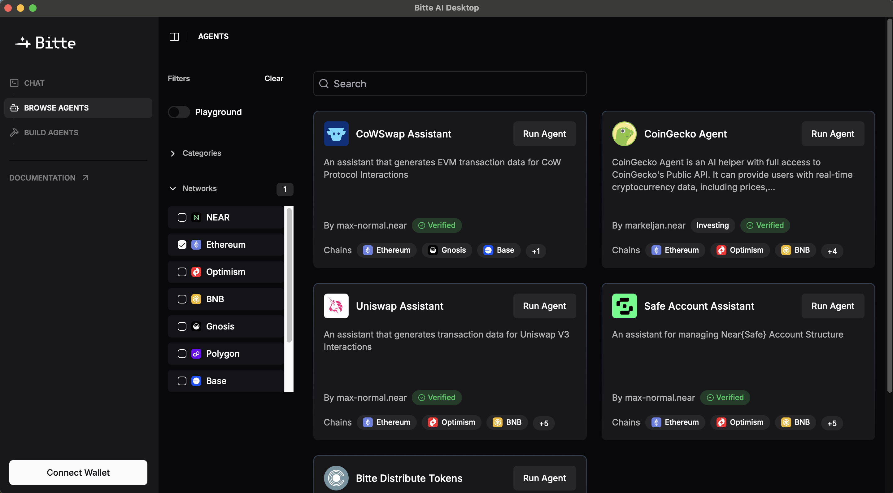

# Bitte AI App

<div align="center">



Interact with blockchain through natural language using AI agents.


[](LICENSE)
[](https://github.com/rubenmarcus/bitte-app/actions)
[](https://github.com/rubenmarcus/bitte-app/actions)

[Download](#download) • [Features](#features) • [Getting Started](#getting-started) • [Documentation](https://bitte.ai/docs)

</div>

## About

Bitte AI App is a revolutionary application that simplifies blockchain interactions through natural language prompts and AI agents. Instead of dealing with complex blockchain interfaces, you can simply tell the AI what you want to do, and it will handle the technical details for you.

## Features

- 🤖 **AI-Powered Interactions**: Communicate with blockchain in natural language
- 🔒 **Secure Transactions**: Built-in security measures for safe blockchain operations
- 🌐 **Multi-Chain Support**: Interact with various blockchain networks
- 💬 **Natural Language Processing**: Convert your instructions into blockchain transactions
- 🔄 **Real-time Updates**: Get instant feedback on your transactions
- 🛡️ **Secure Key Management**: Safe and encrypted storage of your keys
- 📱 **Cross-Platform**: Available for Windows, macOS, Linux, Android, and iOS
- 📱 **Mobile-First Experience**: Optimized interface for mobile devices
- 🔐 **Biometric Authentication**: Secure login with fingerprint/face recognition on mobile

## Download

Download the latest version of Bitte AI Desktop for your operating system:

### Latest Release (v0.1.0)

| Platform | Download |
|----------|----------|
| macOS  | [Bitte Desktop_0.1.0_aarch64.dmg](https://github.com/rubenmarcus/bitte-app/releases/download/v0.1.0/Bitte.Desktop_0.1.0_aarch64.dmg) |
| Windows | [Bitte Desktop_0.1.0_x64.msi]((https://github.com/rubenmarcus/bitte-app/blob/main/src/download/windows/Bitte%20Desktop_0.1.0_x64_en-US.msi) |
| Linux (Debian/Ubuntu) | [bitte-desktop_0.1.0_amd64.deb](https://github.com/rubenmarcus/bitte-app/releases/download/v0.1.0/bitte-desktop_0.1.0_amd64.deb) |
| Android | [Bitte Mobile_0.1.0.apk](https://github.com/rubenmarcus/bitte-app/blob/main/src/download/android/bitte-app.apk) |

[View all releases](https://github.com/rubenmarcus/bitte-app/releases)

## Getting Started

1. Download the appropriate version for your operating system
2. Install the application
3. Launch Bitte AI Desktop
4. Connect your wallet when prompted
5. Start interacting with blockchain using natural language!

## Example Usage

Here are some examples of what you can do with Bitte AI Desktop:

```text
"Send 0.1 ETH to vitalik.eth"
"Swap 100 USDC for ETH on Uniswap"
"Show me my NFT collection"
"What's the current gas price?"
```

## Security

Bitte AI Desktop prioritizes the security of your assets:
- All private keys are stored securely and encrypted
- Transactions require explicit confirmation
- No sensitive data is sent to our servers
- Open-source for transparency

## Development

Built with:
- [Tauri](https://tauri.app/) - For secure, native applications
- [TypeScript](https://www.typescriptlang.org/) - For type-safe code
- [Rust](https://www.rust-lang.org/) - For performance and security
- [React Native](https://reactnative.dev/) - For mobile app development
- [Capacitor](https://capacitorjs.com/) - For cross-platform mobile support

### Building from Source

```bash
# Clone the repository
git clone https://github.com/rubenmarcus/bitte-app.git
cd bitte-app

# Install dependencies
pnpm install

# Run in development mode
pnpm tauri dev

# Build for production
pnpm build:release

# Build for mobile
pnpm build:mobile
```

### Mobile Development Setup

For mobile development, you'll need additional setup:

```bash
# Install mobile development dependencies
pnpm install -D @capacitor/core @capacitor/cli

# Add mobile platforms
pnpm cap add android
pnpm cap add ios

# Open in native IDEs
pnpm cap open android  # Opens Android Studio
pnpm cap open ios      # Opens Xcode
```

## Contributing

We welcome contributions! Please see our [Contributing Guidelines](CONTRIBUTING.md) for details.

## License

This project is licensed under the MIT License - see the [LICENSE](LICENSE) file for details.

## Support

- 📚 [Documentation](https://bitte.ai/docs)
- 💬 [Discord Community](https://discord.gg/bitte)
- 🐦 [Twitter](https://twitter.com/bitteai)
- 📧 [Email Support](mailto:support@bitte.ai)
